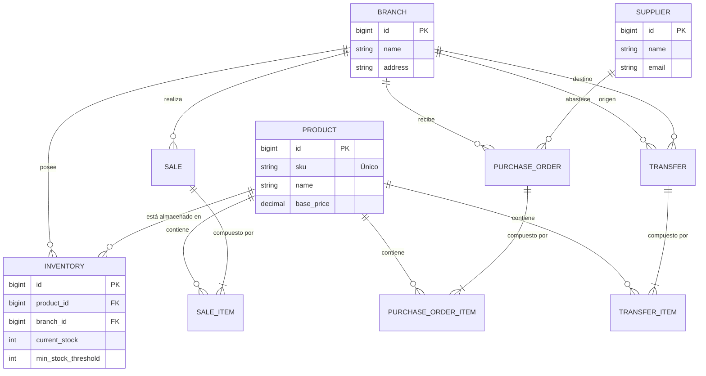

# OptiPlant - Sistema de Inventario Multi-Sucursal 🏭🌿

OptiPlant es un sistema ERP de inventario diseñado específicamente para la gestión centralizada y distribuida de productos botánicos, fertilizantes y herramientas de jardinería a través de múltiples sucursales.

La plataforma permite gestionar el catálogo de productos, controlar las recepciones de proveedores, ejecutar ventas (POS), transferir inventario entre sucursales y generar alertas automáticas cuando el stock cae por debajo del umbral mínimo.

---

## 🛠 Stack Tecnológico y Arquitectura

El sistema está construido bajo una arquitectura de 3 capas separadas, orquestadas mediante **Docker Compose** para asegurar un despliegue homogéneo y reproducible.

*   **Frontend**: React.js 18 + TypeScript + Vite. 
    *   *Estilización*: TailwindCSS (Bento UI Design System, CSS Variables, Glassmorphism).
    *   *Enrutamiento*: React Router DOM.
    *   *Iconografía*: Phosphor Icons.
*   **Backend**: Java 21 + Spring Boot 3 (API REST RESTful).
    *   *Persistencia*: Spring Data JPA + Hibernate.
    *   *Documentación API*: Springdoc OpenAPI (Swagger UI).
    *   *Notificaciones*: Mailtrap Java SDK para notificaciones asíncronas (`@Async`).
*   **Base de Datos**: PostgreSQL 15.

---

## 🏗 Diagrama de Arquitectura

```mermaid
graph TD
    Client[Cliente Web / Navegador] -->|HTTP/REST| Frontend[React + Vite Frontend]
    Frontend -->|Axios (JSON)| API_Gateway[Spring Boot API REST]
    
    subgraph "Backend Services"
        API_Gateway --> ControllerLayer[Controllers]
        ControllerLayer --> ServiceLayer[Services - Lógica de Negocio]
        ServiceLayer --> RepositoryLayer[Spring Data JPA Repositories]
    end
    
    RepositoryLayer -->|TCP/IP - Puerto 5432| DB[(PostgreSQL)]
    ServiceLayer -.->|Notificaciones Asíncronas| Mailtrap[Mailtrap API SDK]
    Mailtrap -.->|Correo SMTP| Admin[Bandeja del Administrador]
```

---

## 📊 Modelo Entidad-Relación (E-R)

El esquema de base de datos relacional asegura la consistencia de los datos (3FN) y soporta bloqueos transaccionales para operaciones concurrentes en el inventario.



---

## 👤 Diagrama de Casos de Uso

Los flujos de trabajo principales del usuario están centralizados en torno a la gestión operativa de cada sucursal.

```mermaid
usecaseDiagram
    actor Gerente as "Gerente de Sucursal"
    
    rectangle "OptiPlant ERP" {
        usecase UC1 as "Consultar Catálogo y Stock Global"
        usecase UC2 as "Registrar Venta (POS)"
        usecase UC3 as "Recepcionar Compra de Proveedor"
        usecase UC4 as "Emitir Transferencia entre Sucursales"
        usecase UC5 as "Notificar Alertas de Stock Crítico"
    }
    
    Gerente --> UC1
    Gerente --> UC2
    Gerente --> UC3
    Gerente --> UC4
    Gerente --> UC5
```

---

## 🚀 Despliegue Rápido (Docker)

El proyecto incluye un entorno pre-configurado para desarrolladores y pruebas técnicas. No es necesario instalar Node.js ni JDK localmente, solo Docker.

### 1. Requisitos
*   Docker y Docker Compose instalados.
*   (Opcional) Un token de Mailtrap para probar el envío real de correos.

### 2. Configuración de Variables
Si deseas habilitar el envío real de correos por Mailtrap, edita el archivo `backend/src/main/resources/application.yml` y coloca tu API Token:

```yaml
app:
  mailtrap:
    token: "TU_API_TOKEN_AQUI"
```

### 3. Levantar los Servicios
En la raíz del proyecto, ejecuta el siguiente comando:

```bash
docker compose up --build
```

Esto compilará el Backend, el Frontend y desplegará la base de datos PostgreSQL. 

### 4. Accesos a la Aplicación
*   **Frontend (OptiPlant UI)**: [http://localhost:3000](http://localhost:3000)
*   **Backend API Base**: [http://localhost:8080/api](http://localhost:8080/api)
*   **Swagger UI (Documentación Interactiva)**: [http://localhost:8080/swagger-ui/index.html](http://localhost:8080/swagger-ui/index.html)

---

## 📌 Evidencia de Uso de IA y Justificación Técnica

Todas las decisiones de diseño arquitectónico han sido cuidadosamente sopesadas para cumplir con los estándares de la industria corporativa:

1.  **¿Por qué se usa un "App Shell" con `overflow-hidden` en Frontend?**
    Para brindar una experiencia de usuario (UX) tipo SaaS empresarial (Bento UI). Evita el scroll global del documento, manteniendo la barra lateral (Sidebar) 100% estática e independiente de la cantidad de contenido en la vista principal, tal como lo dictan los estándares modernos de accesibilidad.
2.  **¿Por qué se utiliza el SDK asíncrono de Mailtrap?**
    La notificación a gerencia (`AlertService`) se encoló utilizando `@Async` y delegando el envío directo al SDK de Mailtrap (`MailtrapClient`) en lugar de SMPT tradicional. Esto garantiza que el hilo HTTP principal no se bloquee mientras se resuelve el DNS del correo, mejorando drásticamente el tiempo de respuesta del Frontend.
3.  **¿Por qué el modelo de datos separa `Product` de `Inventory`?**
    Siguiendo las reglas de la 3ra Forma Normal (3FN), el catálogo (Producto) es universal, pero el nivel de stock (Inventario) varía según la sucursal. Esta separación previene anomalías de actualización y facilita las consultas de transferencias inter-sucursales.
