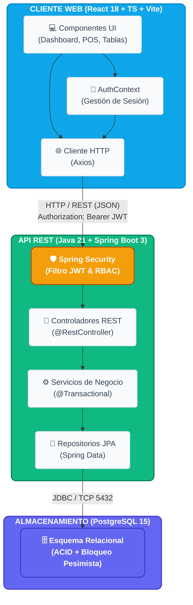
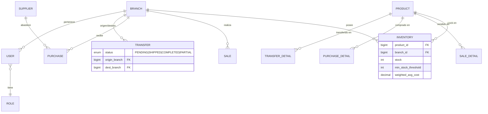

# OptiPlant — Sistema de Inventario Multi-Sucursal

Sistema ERP para gestión de inventario distribuido entre múltiples sucursales. Cada sucursal opera con autonomía operativa mientras comparte visibilidad de inventario con toda la red.

---

## Inicio Rápido

```bash
git clone https://github.com/choclitoxd/optiplant-inventory.git
cd optiplant-inventory
docker compose up --build
```

| Servicio | URL |
|---|---|
| Aplicación Web | http://localhost:3000 |
| API Backend | http://localhost:8080/api |
| Swagger UI | http://localhost:8080/swagger-ui/index.html |

**Credenciales por defecto:** `admin / admin123`

---

## Stack Tecnológico

| Capa | Tecnología | Justificación |
|---|---|---|
| **Frontend** | React 18 + TypeScript + Vite | SPA con tipado estricto; Vite acelera el ciclo dev vs. CRA |
| **Backend** | Java 21 + Spring Boot 3 | Ecosistema maduro, Spring Security integrado para RBAC, JPA para ORM |
| **Base de datos** | PostgreSQL 15 | ACID compliance, soporte nativo para `SELECT ... FOR UPDATE` (bloqueo pesimista) |
| **Contenedores** | Docker Compose | Entorno reproducible con un solo comando; sin dependencias locales de JDK/Node |
| **Autenticación** | JWT (JSON Web Tokens) | Stateless; compatible con arquitectura de microservicios futura |

---

## Arquitectura del Sistema



---

## Modelo de Datos (E-R Simplificado)



**Decisión de diseño:** `PRODUCT` (catálogo global) es independiente de `INVENTORY` (stock por sucursal). Esto cumple 3FN y permite que un producto exista en múltiples sucursales con stocks distintos sin duplicar datos.

---

## Módulos Implementados

### Gestión de Catálogo y Sucursales
- CRUD de productos con SKU, precio base y costo promedio ponderado (CPP)
- Administración de sucursales con activación/desactivación
- Vista de stock por sucursal con filtros

### Módulo de Compras
- Registro de facturas de proveedor (maestro-detalle)
- Cálculo automático de CPP al recibir mercancía:
  ```
  CPP_nuevo = (stock_actual × cpp_anterior + cant_nueva × precio_nuevo)
              ─────────────────────────────────────────────────────────
                            stock_actual + cant_nueva
  ```
- Historial de compras por proveedor

### Módulo de Ventas (POS)
- Caja registradora con catálogo y carrito en tiempo real
- Validación de stock antes de confirmar: `SELECT ... FOR UPDATE` (bloqueo pesimista) previene race conditions en ventas concurrentes
- Historial de ventas con detalle expandible

### Transferencias entre Sucursales
- Flujo en 2 fases: **Envío** (descuenta origen) → **Recepción** (incrementa destino)
- Soporte de **recepción parcial**: si llegan menos unidades de las enviadas, el faltante se registra como merma en `inventory_adjustment`
- Estados: `PENDING → SHIPPED → COMPLETED | PARTIAL`

### Alertas de Stock
- Job programado (`@Scheduled`) que evalúa diariamente productos bajo `min_stock_threshold`
- Panel de alertas con notificación por email vía Mailtrap SDK (asíncrono con `@Async`)

### Dashboard de Análisis
- KPIs: total inventario, ventas del mes, productos en alerta
- Gráfico de valor de inventario por sucursal
- Tabla de productos más vendidos

### Gestión de Usuarios y RBAC

| Rol | Permisos |
|---|---|
| `ROLE_ADMIN` | Acceso global a todas las sucursales. Puede crear/editar cualquier usuario |
| `ROLE_BRANCH_MANAGER` | Ve y gestiona únicamente los usuarios de su sucursal. No puede crear Admins |
| `ROLE_OPERATOR` | Opera el POS y registra compras/transferencias en su sucursal |

**Implementación:** `@PreAuthorize` en controladores + `SecurityContextHolder` en servicios para filtrado dinámico por `branchId` del token JWT.

---

## Casos de Uso — Actores Principales

```
Administrador Global
  ├── Gestiona sucursales (crear, editar, activar/desactivar)
  ├── Gestiona todos los usuarios y roles
  ├── Accede al dashboard global
  └── Aprueba transferencias entre cualquier sucursal

Gerente de Sucursal
  ├── Gestiona usuarios de su sucursal
  ├── Aprueba y recibe transferencias en su nodo
  ├── Consulta stock de otras sucursales
  └── Ve alertas y dashboard de su sucursal

Operador / Cajero
  ├── Registra ventas (POS)
  ├── Registra compras a proveedores
  └── Emite solicitudes de transferencia
```

---

## Reglas de Negocio Clave

1. **Stock nunca negativo:** Validación con bloqueo pesimista (`PESSIMISTIC_WRITE`) en toda venta.
2. **Admin sin sucursal:** El backend fuerza `branchId = null` para `ROLE_ADMIN` independientemente del payload.
3. **Otros roles con sucursal obligatoria:** El backend rechaza con HTTP 400 si `branchId` es null para roles no-admin.
4. **Aislamiento de Gerentes:** Un Gerente solo puede ver/editar usuarios cuyo `branchId` coincida con el suyo. Validado en `UserService.validateManagerAccess()`.
5. **Trazabilidad completa:** Toda venta, compra y transferencia tiene `responsible_user`, `created_at` y `branch` registrados.

---

## Pruebas Unitarias

```
Tests run: 12, Failures: 0, Errors: 0, Skipped: 1
```

| Suite | Casos cubiertos |
|---|---|
| `SaleServiceTest` | Stock suficiente → descuenta; Stock insuficiente → `IllegalArgumentException` |
| `PurchaseServiceTest` | CPP: `(10×$80 + 10×$120) / 20 = $100.00` ✓ |
| `AuthServiceTest` | Admin sin sucursal pasa; Operador sin sucursal falla; Username duplicado falla; Operador con sucursal pasa |
| `TransferServiceTest` | Envío descuenta stock en origen |
| `AlertServiceTest` | Job de alertas detecta productos bajo umbral |
| `DashboardServiceTest` | KPIs se consolidan correctamente |

Para ejecutar los tests:
```bash
docker run --rm -v "$(pwd)/backend:/app" -w /app \
  maven:3.9.6-eclipse-temurin-21-alpine mvn test
```

---

## Variables de Entorno

Copia `.env.example` a `.env` y ajusta si es necesario:

```bash
cp .env.example .env
```

| Variable | Descripción |
|---|---|
| `POSTGRES_DB` | Nombre de la base de datos |
| `POSTGRES_USER` | Usuario de PostgreSQL |
| `POSTGRES_PASSWORD` | Contraseña de PostgreSQL |
| `JWT_SECRET` | Clave secreta para firmar tokens JWT |
| `MAILTRAP_TOKEN` | API Token de Mailtrap (opcional, para emails) |

---

## Evidencia de IA

Ver [`EVIDENCIA_IA.md`](./EVIDENCIA_IA.md) para la descripción completa del uso de Inteligencia Artificial durante el desarrollo, incluyendo prompts clave, evaluación crítica y estimación de contribución por componente.

---

## Estructura del Repositorio

```
optiplant-inventory/
├── backend/                    # Spring Boot API REST
│   ├── src/main/java/          # Código fuente
│   │   └── com/optiplant/inventory/
│   │       ├── controller/     # Endpoints REST
│   │       ├── service/        # Lógica de negocio
│   │       ├── domain/         # Entidades JPA + DTOs
│   │       ├── repository/     # Spring Data Repositories
│   │       ├── security/       # JWT + Spring Security
│   │       └── exception/      # Global Exception Handler
│   └── src/test/               # Tests unitarios JUnit 5
├── frontend/                   # React + TypeScript + Vite
│   └── src/
│       ├── components/         # Componentes reutilizables
│       ├── pages/              # Vistas por ruta
│       ├── services/           # Clientes HTTP (Axios)
│       ├── context/            # AuthContext (JWT)
│       └── types/              # Interfaces TypeScript
├── docker/
│   └── db/init/schema.sql      # Schema inicial de PostgreSQL
├── Diagramas/                  # Diagramas de ingeniería
├── docker-compose.yml          # Orquestación de servicios
├── tablero_kanban.md           # Historial de desarrollo incremental
├── EVIDENCIA_IA.md             # Evidencia de uso de IA
└── README.md                   # Este archivo
```
